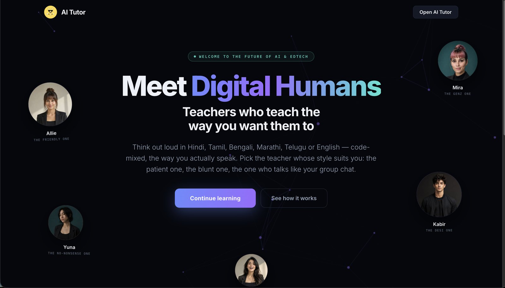
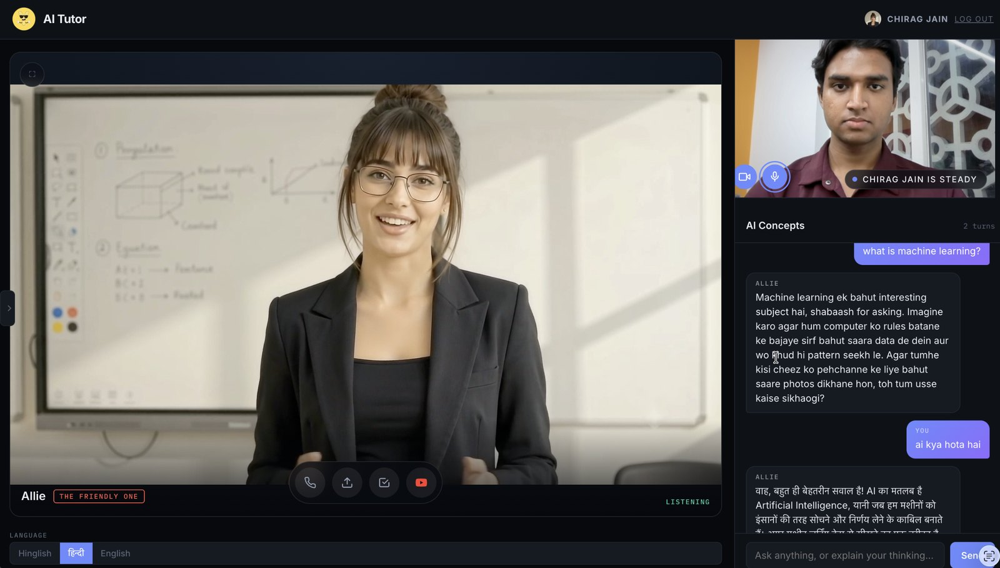

<div align="center">


# AI Tutor

**A tutor that changes its method, not its volume.**

Speak a question out loud in Hindi, Tamil, Bengali or Hinglish. Pick the teacher
whose style actually suits you. If their method isn't landing, a different
teacher takes over — and says why.

Built for **MUJ HACKX 4.0** · *The Teacher Who Learns How You Learn* · Team **Ycotes**

</div>

---



## The problem

A student who gets stuck doesn't need the same explanation repeated louder or
slower. They need a *different* explanation — and usually, in a different
language from the one it was first delivered in.

Indian classrooms run at 1:30 or worse. The second explanation, the one pitched
differently for the one student who didn't follow, is the thing there is never
time for. That is the gap this fills.

## What it does



**Five digital humans, five genuinely different teaching methods.** Not five
skins on one assistant — each teacher owns a method and a register:

| Teacher | Style | Method |
|---|---|---|
| **Allie** | The friendly one | Socratic — asks instead of telling |
| **Yuna** | The no-nonsense one | Cognitive conflict — sets up the prediction, lets it break |
| **Mira** | The GenZ one | Bridging analogy — reels, split bills, group-chat register |
| **Kabir** | The desi one | New representation — chai, rotis, a cricket over |
| **Hanna** | The fun one | Faded worked example — works one, hands back a step at a time |

Pick one and they stay with you. The face changes only when the pedagogy
genuinely calls for a different method — and the switch is announced, not silent.

### It listens

Talk the way you actually talk. Code-mixed speech is read as spoken, never
corrected into English first. **Eleven Indian languages**, and switching to
हिन्दी returns true Devanagari with the teacher's personality intact — not
romanised Hindi wearing a Devanagari coat of paint.

The mic is a **toggle, not a hold**. It listens continuously, submits on its own
when you stop talking, then goes straight back to listening — so you can think
out loud without operating a button.

### It watches

Turn the camera on and your expression is read **entirely on your own device**.
Frustrated gets shorter. Confused gets one step back, not more material. Happy
gets pushed harder. **No video frame ever leaves your browser** — the models are
served from this repo and run in the page.

It changes *how* things are said. Never what is true. The camera is never
mentioned to the student.

### It remembers

Accounts, conversations, transcripts and your chosen teacher all persist. Context
is capped at the last three exchanges, and the model decides for itself whether a
new message is a follow-up or a fresh start — so an old topic can't bleed into a
new one.

---

## Architecture

```
Browser                                    Server
───────                                    ──────
mic → WAV encode ───────────────────────►  /api/stt   → speech recognition
                                                        (code-mixed Indian speech)

camera → expression net (on-device)
   │  never leaves the browser
   └─ mood ─────────────────────────────►  /api/ask   → persona-specific model
                                                        + capped context
                                                        + language/script rules
                                              │
teacher video ◄── idle / speaking loop ◄──────┘
audio         ◄───────────────────────────  /api/tts   → per-teacher voice
```

| Layer | What it is |
|---|---|
| **Speech in** | Recognition tuned for code-mixed Indian speech. Audio is captured and WAV-encoded client-side. |
| **Persona models** | One model configuration per teacher — method, register and language behaviour are specialised per persona, not prompted on top of one generic assistant. |
| **Inference layer** | Schema-enforced and model-agnostic; hosted or self-hosted open-weight models are swappable without touching the app. Automatic fallback so a busy endpoint never ends a lesson. |
| **Vision** | Face detection + 7-class expression network, 528 KB total, on-device via TensorFlow.js. Smoothed with an exponential moving average and hysteresis so the reading never flickers. |
| **Speech out** | 37 voices across 11 Indian languages; each teacher has a distinct, gender-matched voice. |
| **Persistence** | A single JSON store, written atomically. No database to provision. |

**No build step.** Vanilla JS, one Node process, `node server.js`.

---

## Running it

```bash
git clone https://github.com/cjcodezz/MUJHACX4.0.git
cd MUJHACX4.0
npm install

cp .env.example .env      # add your own keys
node server.js            # http://localhost:8091
```

### Environment

| Variable | Required | Notes |
|---|---|---|
| `SPEECH_API_KEY` | yes | Speech recognition and synthesis. |
| `MODEL_API_KEY` | yes | Inference. |
| `MODEL_NAME` | no | Overrides the default model. |
| `VIDEO_API_KEY` | no | Enables the official video Data API; without it, search still works. |
| `PORT` | no | Defaults to `8091`. |

### Docker

```bash
docker build -t ai-tutor .
docker run -p 8091:8091 --env-file .env -v $(pwd)/data:/app/data ai-tutor
```

The container ships a health check that fails if the speech or inference
providers are unreachable — better than serving a page that cannot answer.

### Adding a teacher's artwork

Drop files into `public/avatars/`, named by teacher id:

```
allie.mp4            # idle loop
allie-speaking.mp4   # speaking loop  (optional)
allie.jpg            # still portrait (fallback)
```

Both loops mount at once and cross-fade on opacity when speech starts — a `src`
swap would re-buffer mid-sentence. With no speaking take, the teacher stays on
their idle loop. With no files at all, an audio-reactive presence renders
instead, driven by the real speech waveform.

---

## Source scope

The architecture is all here and it runs end to end. The tuned behaviour is
proprietary and lives in a separate build — see [`NOTICE.md`](NOTICE.md).

Not included: the system prompt, the language and script rules, the five persona
registers in English and Hindi, the researched misconception catalog, and the
diagnosis and item-generation prompts.

Run it with your own keys and it answers — in a generic teacher voice rather
than the tuned personas.

---

## Privacy

- **Camera frames never leave the device.** Detection and expression models are
  served from this repo and execute in the page.
- Passwords are salted and SHA-256 hashed in browser storage. This is demo-grade
  auth for a hackathon build, not production auth.
- Conversations are stored locally in `data/`, per account.

---

<div align="center">

Built in Jaipur by **[Ycotes](https://theycotes.com)**

</div>
